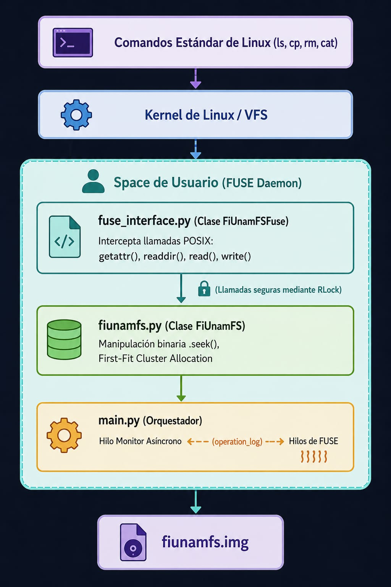
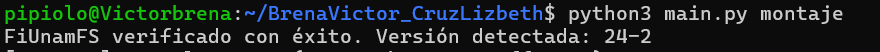
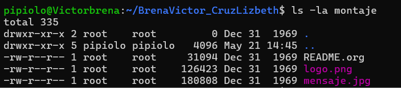
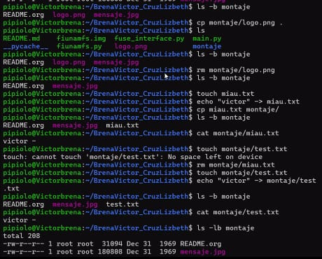
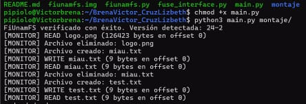

# Micro Sistema de Archivos Multihilos

## 1. Información General y Autores
* **Institución:** Universidad Nacional Autónoma de México (UNAM)
* **Facultad:** Facultad de Ingeniería
* **Asignatura:** Sistemas Operativos (Semestre 2026-2)
* **Profesor:** Gunnar Wolf
* **Autores:** 
    * Brena de León Víctor Javier
  * Cruz Manríquez Lizbeth
* **Fecha de Entrega:** 21 de mayo de 2026

---

## 2. Introducción y Objetivos
Este proyecto consiste en el diseño e implementación en espacio de usuario (FUSE) de un controlador lógico para el sistema de archivos **FiUnamFS**, mapeado sobre un contenedor(`fiunamfs.img`). 

### Objetivo General
Desarrollar un módulo de sistema de archivos completamente funcional que permita la abstracción de operaciones POSIX nativas (filtrado, lectura, escritura, creación y borrado lógico) bajo un entorno concurrente multihilo seguro.

---

## 3. Entorno de Ejecución y Requisitos
El sistema fue diseñado y verificado para operar de manera nativa bajo las siguientes especificaciones de entorno:

* **Sistema Operativo:** Linux (Debian/Ubuntu) o entornos Windows Subsystem for Linux  (WSL2 con Ubuntu e instalacion con soporte de módulos de kernel FUSE habilitado).
* **Lenguaje de Programación:** Python 3.
* **Dependencias de Software:** Requiere los enlaces de la biblioteca FUSE para el usuario.
Se instalan mediante:
  ```bash
  sudo apt update
  sudo apt install python3-fuse
  ```


## 4. Arquitectura del Proyecto (Diseño Modular)
Alineado con los principios de modularidad y separación de responsabilidades en sistemas operativos, el flujo del programa se separo exclusivamente en tres componentes independientes, evitando la proliferación de archivos innecesarios:

```
proyecto/
├── main.py            <-- Orquestador de concurrencia y punto de entrada.
├── fiunamfs.py        <-- Driver binario de bajo nivel (Geometría del disco).
├── fuse_interface.py  <-- Capa de traducción de llamadas POSIX a FUSE.
└── fiunamfs.img       <-- Contenedor binario del disco simulado.
```
Mapa Lógico de Componentes




## 5. Especificaciones Geométricas de FiUnamFS
El diseño del disco virtual se rige de manera estricta bajo los siguientes parámetros binarios fijos:

* Tamaño de Sector: 512 bytes.

* Tamaño de Clúster: 4 sectores (2,048 bytes).

* Tamaño Total del Medio: 1,440 KB.


Distribución de Clústeres (Layout)
* Clúster 0: Superbloque (Firma de identidad FiUnamFS y metadatos de versión).

* Clústeres 1 a 8: Tabla lineal de directorio. Alberga un máximo de 256 entradas (Cada entrada posee una dimensión fija de 64 bytes).

* Clústeres 9 en adelante: Zona de almacenamiento de datos.


## 6. Estrategia de Concurrencia y Sincronización
Para dar cumplimiento a las restricciones asíncronas de la administración de procesos:

*  **Multihilo Transparente:** FUSE opera en modo multihilo nativo controlado por el kernel. Esto implica que múltiples hilos de ejecución pueden invocar de manera simultánea peticiones de I/O (``read/write``) sobre la interfaz.

*  **Exclusión Mutua Reentrante (``RLock``)**: Debido a que la manipulación del contenedor binario se realiza mediante el desplazamiento del apuntador del archivo (.``seek()``), si un hilo altera la posición de lectura antes de que otro concluya su operación, ocurriría una corrupción catastrófica de datos. Se implementó un candado reentrante (``threading.RLock``) que garantiza que solo un hilo a la vez altere la consistencia del disco. Se seleccionó ``RLock``sobre un ``Lock`` ordinario porque los métodos de FUSE realizan llamadas cruzadas internas dentro del mismo hilo, previniendo condiciones de auto-bloqueo (deadlock).

*  **Canales de Comunicación (Patrón Productor-Consumidor)**: Los hilos trabajadores de FUSE actúan como productores de estados, depositando cadenas informativas en una estructura de lista compartida (``operation_log``) cada vez que se efectúa una mutación. Un segundo hilo independiente y persistente (``monitor_thread``) actúa como consumidor, despertando a intervalos regulares para extraer de manera segura los registros y desplegarlos asíncronamente en la salida de error estándar (``sys.stderr``).


## 7. Instrucciones de Uso y Ejemplos de Operación
### Paso 1: Preparación del Entorno
Garantice que el script cuente con los permisos de ejecución del sistema operativo y defina un punto de montaje en la raíz del proyecto:

```bash
chmod +x main.py
mkdir -p montaje
```

### Paso 2: Ejecución del Servidor FUSE (Terminal 1)
Inicia el programa principal pasando como argumento el directorio de montaje creado. El script automáticamente ejecutara en primer plano para retener el ciclo de vida de la terminal y permitir al hilo monitor actualizar las transiciones de estado en tiempo real:

```bash
python3 main.py montaje/
```
Nota: El proceso se quedará retenido en la terminal actual indicando que el volumen virtual está operativo.

### Paso 3: Pruebas de Uso Transparente (Terminal 2)
Abrir una segunda ventana de terminal y ejecutar operaciones de interacción directa:

* Listar el contenido del directorio (Uso  de ``ls``):

```bash
ls -la montaje/
```

* Lectura de archivos y copia externas (Copia hacia afuera con ``cat`` o ``cp``):
```bash
cat montaje/hola.txt
cp montaje/hola.txt ~/Documentos/copia_sistema.txt
```

* Creación y Escritura de datos (Uso  de ``touch`` y ``echo``):
```bash
touch montaje/proyecto.txt
echo "Facultad de Ingenieria UNAM 2026" > montaje/proyecto.txt
```

* Eliminación de archivos (``rm``):

```bash
rm montaje/proyecto.txt
```

A medida que se realizan estas acciones en la Terminal 2, observará cómo la Terminal 1 imprime de forma simultánea los logs asíncronos generados por el hilo de monitoreo:

```bash
[MONITOR] WRITE proyecto.txt (33 bytes en offset 0)
[MONITOR] Archivo eliminado: proyecto.txt
```

### Paso 4: Desmontaje Seguro
Para concluir de manera las pruebas y liberar los descriptores lógicos del kernel de Linux, ejecutar el siguiente comando en la terminal auxiliar:

```bash
fusermount -u montaje/
```

##  8. Resultados de FiUnamFS
Conforme a la ejecucion y pruebas del ``disco`` se obtivo el contenido de este.

### Ejecucion/Montaje


### Listado y contenido

### Pruebas de operaciones (terminal 2)


### Listado del log de operaciones(terminal 1)



## 8. Diagnóstico y Problemas Solucionados
* Validación de Versión Flexible: Se identificaron inconsistencias en los bloques de firmas de las imágenes de prueba proporcionadas entre distintos semestres (versiones 24-2 y 26-2). Se reestructuró ``validate_superblock`` para aceptar dinámicamente ambas variantes, mitigando fallos de montaje automáticos.

* Alineación de Nombres en Directorio: Los nombres de archivo menores a 15 caracteres dejaban remanentes de bytes nulos (``\x00``) o basura binaria en el buffer. Se implementaron filtros basados en ``.strip('\x00').strip()`` en la decodificación del directorio, garantizando la consistencia en las búsquedas lógicas de archivos.

* Bloqueos en el Despliegue: Las escrituras tradicionales en la consola del monitor sufrían retardos severos debido al almacenamiento en búfer de la salida estándar de Python. Se solucionó redirigiendo explícitamente el canal hacia ``sys.stderr`` y forzando la bandera ``flush=True ``para asegurar la asincronía visual inmediata requerida.

* Bloqueo de salida(terminal 1) : Durante las pruebas se genero un bloqueo al desmontaje (``fusermount -u montaje/``) no pudiedo terminar la ejecucion del servidor, donde se atribuye a la relizacion de purebas de forma continua, generando un bloqueo(no genrando una explicacion consisa de este). 