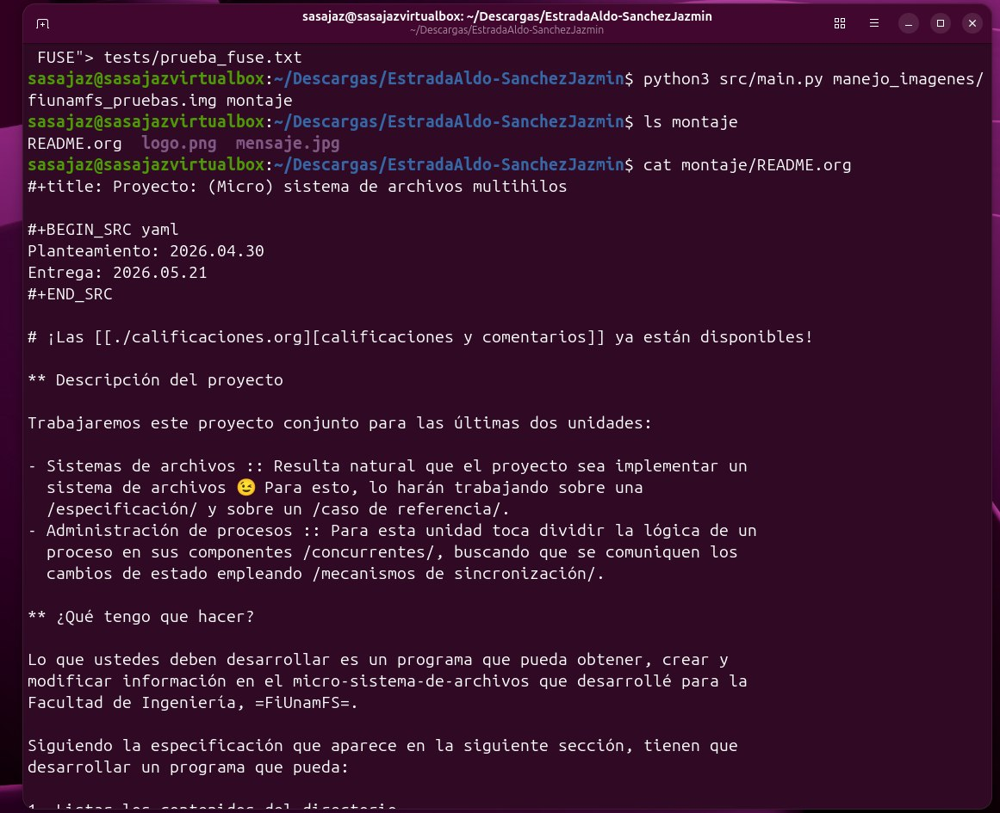
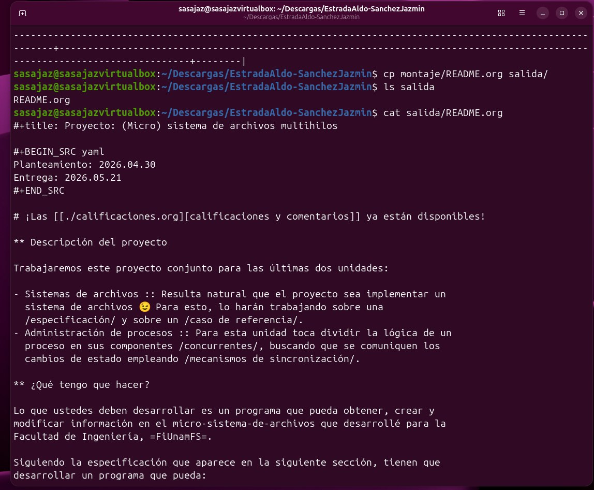
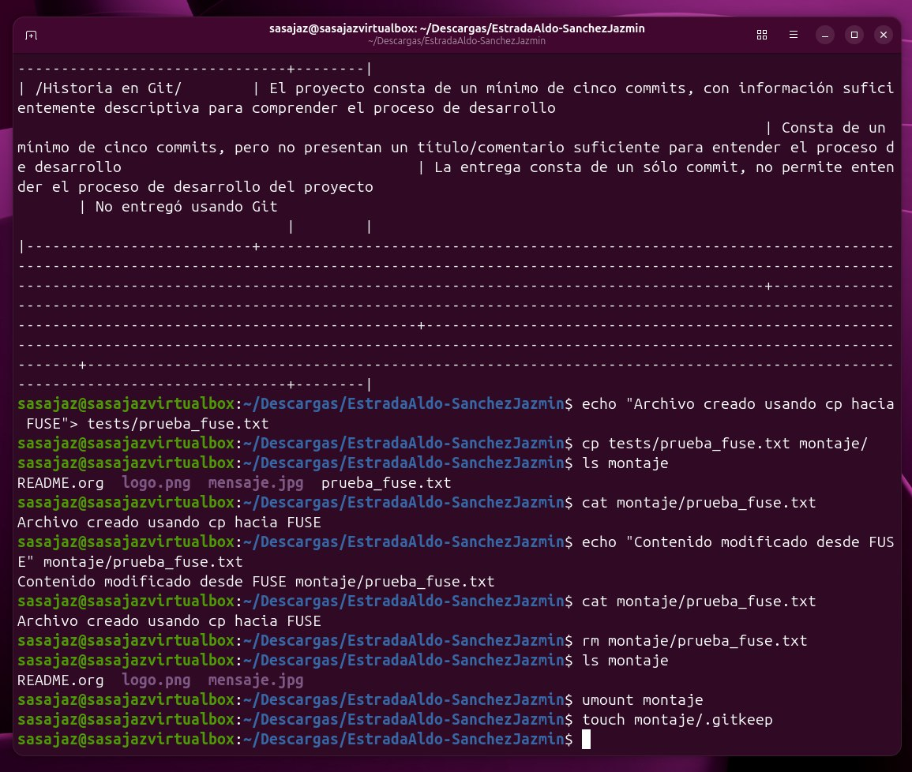

# Proyecto 1: (Micro) sistema de archivos multihilos.
**Fecha de entrega:** 21/05/26.

### Integrantes:
- Estrada Zacarias Aldo Axel
- Sánchez Salazar Jazmín

## Introducción

El presente proyecto consiste en la implementación de un micro sistema de archivos multihilos basado en `FiUnamFS`, desarrollado en Python utilizando FUSE. El sistema permite montar una imagen de disco virtual dentro de Linux y manipular su contenido mediante operaciones estándar como `ls`, `cat`, `cp` y `rm`.

El proyecto implementa operaciones fundamentales sobre la imagen del sistema de archivos, incluyendo listado, lectura, inserción, modificación y eliminación de archivos. Además, incorpora concurrencia mediante hilos y mecanismos de sincronización utilizando `threading.RLock` y una cola de estados para coordinar las operaciones realizadas sobre la imagen montada.

A través de este proyecto se aplicaron conceptos relacionados con sistemas de archivos, sincronización, concurrencia y administración de almacenamiento dentro de entornos Unix/Linux.


## Objetivos.
Con base en las últimas dos unidades **Sistemas de Archivos** y **Administración de Procesos** se diseñó un micro sistema de archivos multihilos, donde se buscó cumplir con los siguientes objetivos:

- Desarrollar un programa capaz de obtener, crear y modificar información dentro del micro sistema de archivos `FiUnamFS`.
- Implementar operaciones para listar, copiar, insertar y eliminar archivos dentro de la imagen del sistema de archivos.
- Montar el sistema de archivos mediante FUSE para permitir su manipulación desde Linux utilizando comandos estándar.
- Incorporar al menos dos hilos de ejecución concurrentes utilizando mecanismos de sincronización.
- Aplicar conceptos de sistemas de archivos, concurrencia y sincronización dentro de un entorno Unix/Linux.


## Descripción del sistema de archivos FiUnamFS.

`FiUnamFS` es un micro sistema de archivos que funciona sobre una imagen de disco con extensión `.img`, dentro de la cual se almacenan archivos siguiendo una estructura específica.

Este sistema de archivos utiliza una organización plana, por lo que no existen carpetas ni subdirectorios; todos los archivos se almacenan dentro de un único directorio principal. Cada archivo contiene información como nombre, tamaño, fechas y cluster inicial dentro de la imagen.

El acceso al contenido de `FiUnamFS` se realiza mediante operaciones de lectura y escritura directamente sobre la imagen del sistema de archivos. En este proyecto, la imagen fue montada utilizando FUSE, lo que permitió manipular su contenido desde Linux como si se tratara de un sistema de archivos convencional.

*Nota:* De acuerdo con las especificaciones del proyecto, el sistema se trabajó con la versión 26-2 de FiUnamFS. Debido a que la imagen original proporcionada por el profesor utilizaba la versión 24-2, se implementó un script auxiliar para modificar la versión y mantener compatibilidad con los requerimientos establecidos.


## Estructura y contenido de carpetas.
Dentro de `EstradaAldo-SanchezJazmin` se encuentran: `src/`, `manejo_imagenes/`, `montaje/`, `salida/` ,`tests/` y `README.md` , que se explican a continuación.

### src/

Contiene la implementación principal del proyecto, incluyendo el manejo del sistema de archivos `FiUnamFS`, la integración con FUSE y la lógica necesaria para realizar operaciones sobre la imagen montada.

### manejo_imagenes/

Contiene la imagen original del sistema de archivos y scripts auxiliares utilizados durante las pruebas y modificaciones de la imagen.

Entre los archivos incluidos se encuentran:

* `modificar_imagen.py`
* `restaurar_imagen.py`

Estos scripts permiten modificar la versión de la imagen utilizada y restaurar la imagen de pruebas a su estado original después de realizar operaciones sobre ella.

### montaje/

Funciona como punto de montaje para FUSE. Al ejecutar el sistema, la imagen `FiUnamFS` es montada dentro de esta carpeta, permitiendo interactuar con los archivos mediante comandos estándar de Linux como `ls`, `cat`, `cp` y `rm`.

*Nota:* La carpeta contiene el archivo `.gitkeep`, que se usa únicamente para conservar el directorio dentro del repositorio Git. Antes de montar el sistema es necesario eliminar temporalmente este archivo, ya que FUSE requiere que el punto de montaje se encuentre completamente vacío.

### salida/

La carpeta `salida/` se utiliza para almacenar archivos copiados desde la imagen `FiUnamFS` hacia el sistema local durante las pruebas realizadas.

---

### tests/

Contiene distintos archivos utilizados para realizar pruebas sobre el sistema de archivos. Estos archivos permiten verificar operaciones como inserción, lectura, modificación y eliminación de archivos dentro de la imagen montada.

También incluye archivos utilizados para validar restricciones del sistema, como el límite máximo permitido para nombres de archivo dentro de `FiUnamFS`.

## Breve Explicación del diseño.

La implementación utiliza `python-fuse` con la API `fuse.fuse_python_api = (0, 2)`, basada en `libfuse 2.x`, permitiendo traducir las operaciones realizadas sobre el punto de montaje hacia operaciones internas sobre la imagen `fiunamfs_pruebas.img`.

El sistema implementa operaciones básicas sobre FiUnamFS, permitiendo interactuar con la imagen montada mediante FUSE.
Entre las operaciones soportadas se encuentran: listado de archivos dentro del sistema, lectura de archivos almacenados en la imagen, copia de archivos desde FiUnamFS hacia el sistema local, inserción de archivos desde el sistema local hacia la imagen, modificación de contenido dentro de archivos almacenados y eliminación de archivos dentro del sistema de archivos.


## Concurrencia y sincronización

En el proyecto se implementó concurrencia mediante dos hilos principales. El primero correspondió a las operaciones realizadas sobre el sistema de archivos, mientras que el segundo se encargó del procesamiento de una cola de estados utilizada para mostrar mensajes sobre las operaciones ejecutadas dentro de `FiUnamFS`.

La cola de estados permite informar acciones como listado, inserción, modificación y eliminación de archivos mientras existan operaciones pendientes por procesar.

Para proteger las operaciones críticas sobre la imagen del sistema de archivos se utilizó `threading.RLock`. Este mecanismo permite que un mismo hilo pueda adquirir el candado múltiples veces de forma segura, evitando bloqueos durante llamadas internas entre métodos que también requieran acceso sincronizado.

El uso de `RLock` permite mantener la consistencia de la imagen y evitar conflictos durante operaciones concurrentes realizadas sobre el sistema montado mediante FUSE.

## Instrucciones de instalación y ejecución.

Este programa fue desarrollado en Python para sistemas Unix/Linux. En nuestro caso, fue en un entorno Ubuntu/Linux para realizar las pruebas y se utilizó FUSE para el montaje del sistema de archivos.

#### Requisitos previos:
- Sistema operativo Unix/Linux o entorno compatible (WSL en Windows).
- Python3 (Python 3.10 o superior).
- FUSE (libfuse 2.x)
- Git
#### Instalación de dependencias.
Actualizar repositorios:
```bash
sudo apt update
```
Instalar FUSE y dependencias necesarias:
```bash
sudo apt install python3-fuse fuse
```
Antes de generar el sistema es necesario eliminar temporalmente el archivo .gitkeep de la carpeta montaje/, ya que FUSE requiere que el directorio se encuentre vacío, lo anterior se realiza con `rm -f montaje/.gitkeep`

### Ejecución del sistema.
Para montar la imagen FiUnamFS usando FUSE:
```bash
python3 src/main.py manejo_imagenes/fiunamfs_pruebas.img montaje
```
Para desmontar se utiliza:
```bash
umount montaje
```
Una vez desmontado el sistema, se puede restaurar el archivo .gitkeep para conservar la carpeta dentro del repositorio Git con `touch montaje/.gitkeep`

*Notas:* Durante el desarrollo también se implementó un modo de prueba desde terminal que permitió ejecutar operaciones directamente sobre la imagen FiUnamFS sin necesidad de montar el sistema mediante FUSE (desde línea de comandos).

Estas pruebas incluyeron operaciones como listado, lectura, copia, inserción y eliminación de archivos utilizando argumentos desde línea de comandos. 

| Argumento | Descripción |
|---|---|
| `--listar` | Lista los archivos en FiUnamFS |
| `--copiar ARCHIVO --destino DIR` | Copia un archivo de FiUnamFS hacia el sistema local |
| `--insertar ARCHIVO` | Inserta un archivo local en FiUnamFS |
| `--eliminar ARCHIVO` | Elimina un archivo de FiUnamFS |

Esto para validar el funcionamiento interno del sistema antes de integrarlo completamente con FUSE.

## Ejemplo de Uso 
Una vez montado el sistema como se indicó en la parte de ejecución del sistema, es posible listar y leer archivos usando:
```bash
ls montaje 
cat montaje/README.org
```


Luego, copiar archivos desde FiUnamFS hacia la carpeta salida/:
```bash
cp montaje/README.org salida/
```
Después verificamos el correcto copiado del archivo con:
```bash
ls salida
cat salida/README.org
```


Una vez verificado podemos realizar la inserción, modificación y eliminación de archivos, para ello, creamos un archivo de prueba y lo copiamos en el sistema montado:
```bash
echo "Archivo creado usando cp hacia FUSE"> tests/prueba_fuse.txt
cp tests/prueba_fuse.txt montaje/
```
Verificando el contenido:
```bash
cat montaje/prueba_fuse.txt
```
Modificando:
```bash
echo "Contenido modificado desde Fuse"> montaje/prueba_fuse.txt
```
Eliminando el archivo del sistema:
```bash
rm montaje/prueba_fuse.txt
```


## Conclusión

El proyecto cumplió con el objetivo de implementar un micro sistema de archivos basado en `FiUnamFS`, lo que permitió realizar operaciones de listado, lectura, copia, inserción, modificación y eliminación de archivos mediante FUSE dentro de un entorno Linux.

Igualmente, se aplicaron conceptos de concurrencia y sincronización utilizando hilos, una cola de estados y mecanismos de bloqueo para proteger las operaciones realizadas sobre la imagen del sistema de archivos.

Por lo que se concluyó que el desarrollo del proyecto permitió comprender de forma práctica el funcionamiento interno de un sistema de archivos, la integración de FUSE dentro de sistemas Unix/Linux y la administración de procesos.
