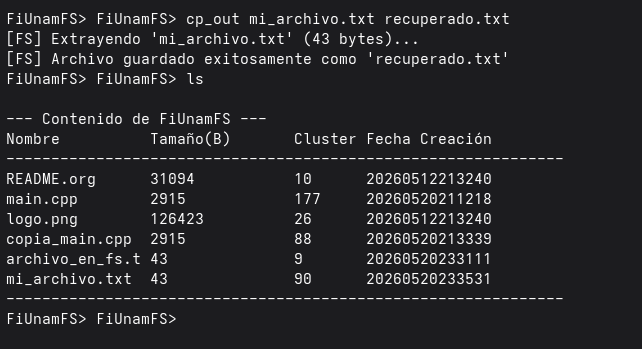
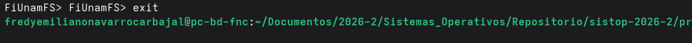

# Proyecto: (Micro) sistema de archivos multihilos 

## Autores
 - Navarro Carbajal Fredy Emiliano 
 - Ramírez Terán Emily 
 
## Entorno de Ejecución
**Lenguaje:** C++ (estándar C++11)
**Sincronización:** Uso de `std::mutex` y `std::condition_variable` para evitar el _busy-waiting_ (espera activa).
**Gestión de Memoria:** Implementación de un mapa de bits (_bitmask_) para la asignación de clusters contiguos.
**Formato:** Sistema de archivos basado en clusters de 2048 bytes con soporte para 256 entradas de directorio.
**Sistema operativo**  Distribución Fedora basada en Linux/Unix.
**Compildor** GCC (`g++`) con soporte para C++ estándar.

## Instrucciones de compilación y ejecución 

1. **Compilación:** 
```bash
g++ -std=c++11 main.cpp sistema_archivos.cpp -o fiunamfs -pthread
```
2. **Ejecución:** 
```bash
./fiunamfs
```
## Guía de Uso (Ejemplos)
Una vez iniciado el sistema:
1. **Listar:**
 `ls` 
 Despliega el contenido de la tabla de directorios con sus metadatos.
 
2. **Importar:** 
 `cp_in <archivo_local> <nombre_fs>`
 Transfiere un archivo local al FS mediante asignación contigua.
  
3. **Exportar:** 
`cp_out <archivo_fs> <nombre_local>`
Extrae el contenido binario del FS hacia el host local.
  
4. **Eliminar:** 
`rm <nombre_fs>`
Realiza un borrado lógico, marcando el cluster como disponible.
  
5. **Salir:** 
`exit`
Cierra de forma ordenada los hilos, evitando fugas de memoria o corrupción.
  

## Arquitectura del Motor (Concurrencia)
La implementación se basa en un hilo consumidor que espera instrucciones a través de una cola compartida. 
- **Productor (Main Thread):** Actúa como el _Shell_. Se encarga de la tokenización de comandos y la inyección de tareas en una cola (`std::queue<Tarea>`).

- **Consumidor (Motor Thread):** Es el proceso que ejecuta las operaciones de persistencia. Su importancia radica en el uso de `std::condition_variable`, la cual evita la espera activa, suspendiendo el hilo hasta que exista una instrucción pendiente, optimizando así el uso de recursos del CPU.

## Estrategia de Algoritmos y Operaciones

### 1. Gestión de espacio (Asignación contigua)
Para el comando `cp_in`, se implementó un algoritmo de búsqueda de **segmentos contiguos**:
- El sistema revisa el mapa de bits buscando bloques libres consecutivos suficientes para cubrir el tamaño del archivo solicitado.
- Si no existe un segmento contiguo del tamaño requerido, el sistema notifica si no puede realizar la inserción, evitando la fragmentación interna.

### 2. Borrado lógico
Para optimizar el rendimiento, la función `rm` no sobrescribe el contenido del archivo en el disco:
- Modifica el metadato en la `EntradaDirectorio` cambiando el tipo a `/` y rellenando el nombre con `#######`.
- Esto permite una eliminación instantánea sin perder tiempo de costos de I/O.

### 3. Manejo de errores y padding
Durante la lectura binaria, se detectaron discrepancias por caracteres de relleno (*padding*), por lo cual se implementó una limpieza de cadenas mediante `find_last_not_of(" \x00")`, lo que garantiza que los nombres de archivos no contengan basura binaria al ser listados.

Para el comando `cp_in`, se implementó un algoritmo de búsqueda de **segmentos contiguos**:
- El sistema escanea el mapa de bits buscando bloques libres consecutivos suficientes para cubrir el tamaño del archivo solicitado.
- Si no existe un segmento contiguo del tamaño requerido, el sistema notifica la imposibilidad de insertar, evitando la fragmentación interna no controlada.

## Estructura del Código (Componentes Clave)

### **`main.cpp`**
Este componente actúa como la interfaz interactiva y el controlador de concurrencia. Es el equivalente al _Shell_ del sistema operativo.
-   **Tokenización y parsing:** Utilizando `std::istringstream` y `std::getline` para capturar comandos del usuario, previniendo desbordamientos de búfer por entradas vacías o malformadas.
    
-   **Patrón Productor-Consumidor:** Implementa la concurrencia instanciando el hilo principal (Productor) y el hilo `motor_archivos` (Consumidor).
    
-   **Gestión de sección crítica:** Administra el objeto compartido `std::queue<Tarea>`. Utiliza `std::unique_lock<std::mutex>` y `std::condition_variable` para inyectar los comandos de forma segura y despertar al motor solo cuando hay carga de trabajo, eliminando la espera activa.

    
###   **`sistema_archivos.h`**
Funciona como una API entre el _Shell_ y el controlador del disco virtual.

-   **Definición de Constantes de Hardware Virtual:** Centraliza los parámetros físicos del disco, como `RUTA_DISCO = "fiunamfs.img"`, `TAMANO_CLUSTER = 2048` bytes, y el límite estricto de `ENTRADAS_POR_DIRECTORIO = 256`.
    
-   **Desacoplamiento:** Expone únicamente las firmas de las funciones de alto nivel (`listar_directorio`, `copiar_hacia_fs`, etc.).
   
###   **`sistema_archivos.cpp`**
Es el núcleo del proyecto. Aquí ocurre la traducción de peticiones a escrituras físicas.

-   **Navegación Binaria (Offsets):** Se utiliza la librería `<fstream>` en modo `ios::binary`. Implementa desplazamientos mediante `seekg()` (para posicionar el puntero de lectura) y `seekp()` (para el puntero de escritura), multiplicando el tamaño del cluster por el índice correspondiente.
    
-   **Algoritmo de asignación contigua:** Reconstruye dinámicamente un mapa de bits (`std::vector<bool>`) leyendo las entradas activas del directorio para identificar qué clusters están ocupados, buscando subsecuentemente un bloque de _N_ clusters libres consecutivos.
    
-   **Manejo de cadenas:** Implementa rutinas de limpieza utilizando `find_last_not_of(" \x00")` para depurar el relleno de ceros o espacios propio de las estructuras binarias de tamaño fijo, evitando basura en la salida estándar.
 
###   **`estructuras.h`**
Define la forma en bytes del disco virtual.

-   **Alineación de Estructuras :** Define los _records_ exactos (`Superbloque` y `EntradaDirectorio`). Esto nos permite aprovechar el operador `sizeof()` para realizar la lectura/escritura de bloques completos de memoria de una sola pasada hacia la imagen de disco utilizando `reinterpret_cast<char*>`, emulando cómo los sistemas operativos reales cargan los inodos o bloques de metadatos desde el hardware.

## Flujo de Ejecución (Ciclo de Vida de una Tarea)
Para entender cómo el programa procesa una solicitud, podemos visualizar el flujo en cuatro etapas clave:

1.  **Captura y encolado (Productor):**
    
    -   El usuario ingresa un comando (ej. `cp_in`). El hilo `main` lo lee, lo empaqueta en un objeto `Tarea` y lo inserta en la `cola_tareas`.
        
    -   El productor ejecuta `cv.notify_one()` para despertar al motor, indicando que hay trabajo pendiente.
        
2.  **Activación del motor (Consumidor):**
    
    -   El hilo motor, que permanecía bloqueado en `cv.wait()` para ahorrar ciclos de CPU, detecta la señal.
        
    -   El motor adquiere el `mutex`, extrae la tarea de la cola y, **críticamente**, libera el `mutex` inmediatamente. Esto permite que el hilo principal siga aceptando nuevos comandos del usuario mientras el motor realiza las operaciones lentas de escritura en disco.
        
3.  **Procesamiento y acceso a disco:**
    
       -   El motor invoca la función correspondiente (ej. `copiar_hacia_fs`).
        
    -   El sistema calcula el _offset_ necesario, verifica el mapa de bits de clusters libres y realiza la escritura binaria o modificación de metadatos en el archivo `.img`.
        
4.  **Respuesta:**
    
    -   Una vez terminada la operación de I/O, el motor imprime el mensaje de éxito o error.
        
    -   El motor vuelve a evaluar la condición de `apagar_sistema`, si es `false`, de lo contrario regresa al estado de espera, manteniendo el sistema listo para la siguiente instrucción.
    
## Aciertos y Retos 

**Retos** 
El principal desafío técnico radicó en la **sincronización de hilos y la manipulación de punteros en archivos binarios**, además de una **curva de aprendizaje inicial con las librerías estándar de C++ un poco pesada**. Debido a nuestra falta de familiaridad con ciertas bibliotecas (como las de concurrencia y el manejo de flujos binarios) representó un obstáculo que retrasó las primeras fases del desarrollo, obligándonos a investigar su funcionamiento. Sumado a esto, fue complejo asegurar que el hilo principal (interfaz) y el hilo del motor (I/O) interactuaran de forma correcta mediante el patrón Productor-Consumidor sin generar condiciones de carrera ni bloqueos por espera activa. Por último, la lectura/escritura con `fstream` nos exigió un cálculo de los desplazamientos (`seekg` y `seekp`) y un tratamiento cuidadoso de los caracteres de relleno (`\x00`), ya que cualquier byte desfasado corrompía la visualización de los nombres de longitud fija (15 caracteres).

**Aciertos** 
Un factor determinante para el éxito del proyecto fue el **conocimiento acumulado de las prácticas anteriores**. Gracias al desarrollo previo de la _MiniShell_ y los ejercicios de sincronización, la implementación de la concurrencia (uso de hilos, `mutex` y variables de condición) nos resultó mucho más natural y fluida. De igual manera, la lógica analítica estructurada durante la simulación de los **planificadores de procesos** (FCFS, RR, SPN, etc.) nos facilitó visualizar y programar los algoritmos de búsqueda, asignación contigua y eliminación de espacios en el disco virtual. A nivel técnico, el diseño de estructuras alineadas en memoria para extraer datos mediante `reinterpret_cast`, sumado a la estrategia de realizar un borrado lógico en lugar de físico, garantizó un buen rendimiento del programa.

**Enseñanza** 
Finalmente, este proyecto nos permitió comprender cómo los sistemas operativos **abstraen el hardware subyacente**. Comandos que como usuarios damos por hecho todos los días en la terminal, como un simple `ls` o `cp`, nos esconden un escenario complejo de algoritmos como: asignación contigua, cálculos de clusters y protección de zonas críticas. Aprendimos que la robustez de un sistema no depende solo de saber guardar la información, sino de preservar la integridad de los datos. Además, la integración de Modelos de Lenguaje Grande (LLMs) como herramienta de asistencia resultó de gran ayuda, ya que nos brindó sugerencias de diseño, nos guio en el uso de nuevas librerías y nos ayudó a entender mejor el comportamiento del código. 
Por ultimo aunque somos conscientes de que apenas hemos visto los superficial, terminamos el curso con la satisfacción de tener un entendimiento mucho más claro de lo que ocurre en nuestras computadoras. Ese conocimiento que ahora tenemos, cambia por completo nuestra perspectiva, muchas gracias.
