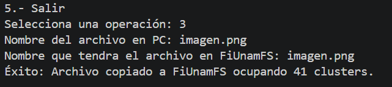
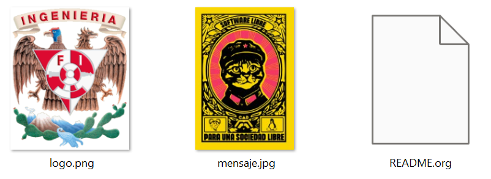

# Proyecto 1:  Sistema de archivos multihilos “FiUnamFS” 

Universidad Nacional Autónoma de México
Facultad de Ingeniería
Sistemas Operativos 

Alumnos: 
- Garibay Zamorano Josué Benjamín
- López López Carlos Daniel

Fecha de entrega: 21 / 05 / 2026

  
## 1.- Especificaciones del proyecto 

Para la realización de este proyecto se nos solicitó desarrollar un programa el cual pueda ser capaz de obtener, crear y modificar la información en un microsistema de archivos, así mismo se nos solicitó la implementación de dos hilos concurrentes. 

Es decir nuestra tarea para este proyecto es crear un programa que pueda: 
1. Listar los contenidos del directorio. 
2. Copiar uno de los archivos que está dentro del microsistema FiUnamFS hacia nuestro sistema. 
3. Copiar un archivo de nuestra computadora hacia FiUnamFS. 
4. Eliminar un archivo del microsistema FiUnamFS. 

Como se mencionaba nuestro programa debe de implementar por lo menos dos hilos concurrentes, utilizando mecanismos de sincronización. 

Este proyecto ciertamente supone un reto y engloba en gran medida todo lo que hemos aprendido en el curso, pues incluso hacemos uso de hilos, algo que aprendimos hace algunos meses y que implementamos junto con los mecanismos de sincronización al resolver el problema del Elevador (problema el cual nosotros elegimos en su momento), así mismo este proyecto engloba los dos últimos temas del curso, los cuales son “Sistemas de archivos” y “Administración de procesos”. 

## 2.- Estrategias de implementación 

- **Gestión del Sistema de Archivos**: Para nuestro sistema de archivos vamos a trabajar en un archivo de longitud fija de 1440 KB dividido en clusters de 2048 bytes, mientras que para la escritura de datos se implementó un algoritmo de asignación contigua, el cual barre secuencialmente la memoria para encontrar el primer hueco disponible capaz de alojar el archivo a insertar, este algoritmo es bastante sencillo, aunque cuenta con el problema de que no nos permite crecer nuestro archivo ya que si hay otro archivo insertado en donde termina nuestro primer archivo entonces no se nos permite crecer el primer archivo. Para todas las conversiones numéricas para el tamaño y los apuntadores de clusters se representan en formato little endian de 32 bits.

- **Arquitectura Concurrente**: Para evitar que la interfaz de usuario sufra algún inconveniente durante las operaciones de entrada y salida, y además cumplir con los requisitos del proyecto de implementar por lo menos dos hilos concurrentes implementamos el modelo “Productor-Consumidor”, donde el hilo principal maneja la interfaz, mientras que un hilo demonio en segundo plano ejecuta exclusivamente las lecturas y escrituras sobre el disco.

## 3.- Descripción de la Sincronización Empleada 

El programa emplea tres tipos de sincronización para comunicar el estado y evitar condiciones de carrera:

1. Paso de Mensajes: El hilo principal y el hilo trabajador se comunican a través de una estructura queue.Queue, donde el hilo principal toma las peticiones del usuario en objetos llamados PeticionFS y los encola, mientras que el hilo trabajador extrae y procesa estas peticiones una por una.
2. Eventos de Bloqueo (threading.Event): Cada objeto PeticionFS cuenta con un evento integrado que, al enviarse una petición, el hilo principal se suspende voluntariamente con wait(), y una vez que el hilo trabajador termina la operación en el disco, activa la señal set(), comunicando su cambio de estado y despertando al hilo principal para mostrar los resultados.
3. Exclusión Mutua (threading.Lock): Para proteger la integridad, el hilo trabajador implementa un cerrojo lock para garantizar que, internamente, ninguna operación pueda sobreponerse a otra.

## 4.- Lenguaje y requerimientos de ejecución 

Para el desarrollo de este proyecto decidimos utilizar Python, esto debido a que es el lenguaje con el que hemos venido trabajando durante todo este semestre, por lo que por comodidad (y costumbre ;D) es el lenguaje por el que nos decidimos, donde gracias a Python podemos hacer uso de las siguientes bibliotecas: 

- **os**: Para la validación de rutas locales (Como para encontrar el archivo .img).
- **struct**: Para el empaquetamiento y desempaquetamiento en little endian (<I).
- **threading y queue**: Para el manejo de hilos y sincronización de estado.
- **datetime**: Para la generación de marcas de tiempo en formato AAAAMMDDHHMMSS.

Las cuales nos son de utilidad para cumplir con lo solicitado en el proyecto. 
Para ejecutar este programa es necesario tener instalado Python en nuestro equipo donde lo vayamos a ejecutar, así mismo debemos de tener en cuenta algo muy IMPORTANTE, que es que debemos de tener a nuestro archivo fiunamfs.img en la misma ruta donde se tiene en ejecución nuestro programa de python, y este debe corresponder a la versión de implementación 24-2 o 26-2, esto porque se nos pedía en las especificaciones que utilizaramos la versión 26-2, sin embargo el disco solo funcionaba con la versión 24-2, así que optamos por que el programa dejará pasar alguna de estas dos versiones. 

## 5.- Funcionamiento del sistema

Al ejecutar el Script se lanzarán en la terminal 5 opciones en forma de menú, las cuales hacen lo siguiente:

1. **Listar:** El programa revisa el disco y muestra una tabla con todos los archivos que están guardados ahí, diciéndo el cómo se llaman, cuánto pesan, el cluster inicial donde se guardaron y cuándo se crearon. 
2. **Copiar un archivo a mi PC:** Esta opción permite sacar cualquier archivo del disco y guardarlo en la computadora, solo pide el nombre del archivo y como se quiere nombrar en la PC. 
3. **Copiar un archivo al disco:** Permite que cualquier archivo de la computadora sea guardado en el disco, solo pide el nombre del archivo y como se quiere nombrar en disco. 
4. **Eliminar un archivo de disco:** Esta opción permite eliminar cualquier archivo del disco con solo colocar su nombre junto con su extensión.
5. **Salir del programa:** Cierra de forma segura el programa.

En la terminal, al ejecutar el programa, las opciones se muestran de la siguiente manera:

## 6.- Ejemplos de uso

Para verificar la correcta implementación del programa realizaremos los siguientes casos que prueban las 5 funciones del sistema:

- **Listar contenidos**
Al elegír la opción 1 se mostraron en pantalla el nombre de los archivos del disco, el tamaño que ocupan, su fecha de creación y el cluster inicial.

- **Extraer un archivo a la PC**
Para extraer cualquier documento del disco se debe elegir la opción 2, que en este caso la utilizaremos para sacar del disco la imagen 'logo.png'.

- **Insertar un archivo al disco**
Con esta opción insertamos la imagen de nombre "imagen.png", la cual colocamos en la carpeta donde esta el disco para probar esta opción del menú.

- **Eliminar un archivo del disco**
Para eliminar cualquier documento del disco se debe elegir la opción 4, que en este caso eliminamos la imagen que habíamos puesto con la opción 3.

- **Salir del programa**
La opción 5 del menú cierra el programa y muestra el mensaje "Vuelva pronto"

## 7.- ¿Qué obtuvimos del disco?

Obtuvimos dos imágenes, una del logo de la facultad de ingeniería, otro de un gato defendiendo el software libre :D y el README de las indicaciones del proyecto.

## 8.- Dudas y comentarios 

Sobre el desarrollo de este proyecto tuvimos algunas dudas que íbamos solucionando sobre la marcha, uno de los más importantes es sobre las especificaciones y es que se nos indicaba que la versión del disco debía ser 26-2, pero la prueba era 24-2, lo que nos dejó la duda de si parte de nuestra labor era definir ese disco o usted iba a ejecutar nuestro programa con un nuevo disco. 

Un comentario que queríamos realizar es que no supimos o pudimos hacer una integración completa con FUSE y no fue por falta de ganas, fue por falta de tiempo y conocimiento, el final de semestre nos está apretando demasiado y el investigar sobre cómo implementarlo nos estaba consumiendo demasiado, por lo que optamos por no realizarlo, de igual forma quisimos ver su implementación usando un LLM pero se nos hizo muy deshonesto además de que cambiaba demasiado nuestro código y el cómo lo estamos implementando sumado a que no terminamos de comprenderlo decidimos seguir un desarrollo sin FUSE.

