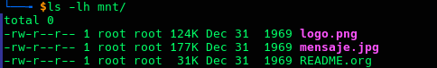
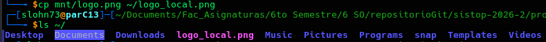
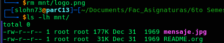

# FiUnamFS — Micro sistema de archivos multihilo con FUSE

**Proyecto planteado:** 2026.04.30
**Entrega**: 2026.05.21

**Alumnos:**

* Monroy Tapia Jesús Alejandro
* Ponce de León Reyes Bruno

## Objetivo

El objetivo de este proyecto es desarrollar un programa multihilo que interactúe con un micro-sistema de archivos simulado (**FiUnamFS**) para poner en práctica y evaluar conceptos de sistemas de archivos y administración de procesos. En concreto, se debe crear una herramienta capaz de leer y modificar la estructura binaria de un disco virtual para listar, extraer, insertar y eliminar archivos, garantizando además que el programa opere de forma concurrente empleando hilos de ejecución que se comuniquen mediante mecanismos de sincronización vistos a lo largo del curso de Sistemas Operativos.

## Descripción

`fiunamfs` es un módulo FUSE que monta una imagen de disco que sigue la
especificación **FiUnamFS** (disco de 1 440 KiB, sectores de 512 bytes,
clusters de 4 sectores, directorio plano de 8 clusters).

Una vez montado, el sistema de archivos aparece como un directorio normal del
sistema anfitrión y puede operarse con comandos estándar como `ls`, `cp`, `rm`,
entre otros.

> **Versiones soportadas:** `24-2` y `26-2`. El programa detecta
> automáticamente la versión de la imagen al montar y acepta cualquiera de las
> dos sin necesidad de modificar el código ni recompilar.

## Requisitos de uso


| Componente     | Versión mínima              |
| -------------- | ----------------------------- |
| GCC            | 11                            |
| libfuse3-dev   | 3.x                           |
| POSIX pthreads | (incluido en glibc)           |
| Linux kernel   | 5.x con módulo`fuse` cargado |

```bash
make
```

Genera el ejecutable `./fiunamfs`. Para limpiar y recompilar desde cero el proyecto por favor ejecutar el siguiente comando:

```bash
make clean && make
```

## Instrucciones de uso

Se requiere tener el ejecutable `./fiunamfs` compilado y un archivo imagen `.img`. Como el que se entrega para la elaboración de este proyecto la imagen actúa como un disco virtual sobre el que el sistema de archivos opera.

A continuacion se muestra listados los comandos que se deben ejecutar **linea por linea** para poder operar correctamente el sistema de archivos solicitado en este proyecto

```bash
# 1. Crear punto de montaje
mkdir -p mnt

# 2. Montar la imagen en primer plano (muestra mensajes de diagnóstico)
./fiunamfs fiunamfs.img mnt -f

```

Al montar correctamente el programa imprime un diagnóstico como este:

```
FiUnamFS montando 'fiunamfs.img'
 > Etiqueta           : MiFiUnamFS
 > Version detectada  : 24-2
 > Tamanio del cluster: 2048 bytes
 > Clusters para Dir  : 8
 > Total de clusters  : 720
 > Archivos encontrados: 3
```

```bash

# 3. En OTRA terminal, operar normalmente:

ls -lh mnt/                          # listar contenido
cp mnt/archivo.txt ~/copia.txt       # copiar DESDE FiUnamFS al sistema
cp ~/mi_archivo.txt mnt/destino.txt  # copiar DEL sistema HACIA FiUnamFS
rm mnt/archivo.txt                   # eliminar archivo del FiUnamFS
mv mnt/viejo.txt mnt/nuevo.txt       # renombrar archivo
df -h mnt/                           # ver espacio disponible

# 4. Desmontar (cierra sync_thread y el descriptor de disco)
fusermount3 -u mnt
```

Los comandos anteriores son para la operacion del sistema de archivos tras terminar de montar correctamente la imagen con los primeros comandos mencionados al inicio de este apartado, como podemos ver cada uno de los comandos es una instruccion que se solicita para la comprobacion practica y funcional de este proyecto de sistemas de archivos.

Empezando con algo relativamente sencillo que es listar el sistema, despues poder copiar archivos de nuestro sistema FUSE a nuestra computadora y viceversa.

Asi como operaciones un poco mas riesgosas como es eliminar archivos y renombrarlos sin afectar el funcionamiento de nuestro sistema de archivos.

## Verificar la versión de una imagen sin montar

Si se quiere saber la versión de una imagen antes de montarla, se puede leer
directamente el superbloque con `dd`:

```bash
dd if=fiunamfs.img bs=1 skip=14 count=5 2>/dev/null
```

Salida esperada:

```
24-2
```

En este caso se trabajo a lo largo del proyecto con una imagen que tenia como version 24-2 sin embargo se realizaron las modificaciones necesarias para poder aceptar otro tipo de disco que es la version 26-2, por lo que a lo largo de las ejecuciones mostradas en este proyecto se vera que la version del disco es 24-2. Pero debido a los cambios dentro del codigo deberia ser capaz de aceptar la 26-2.

Sin embargo esto es solamente en esas versiones si se intenta probar alguna otra como 25-1, 25-2, 23-2, etc. El programa marcara error debido a que no reconoce la version de la imagen del disco.

Los bytes 14-18 del cluster 0 contienen la cadena de versión del sistema de
archivos según la especificación FiUnamFS.

## Comportamiento conocido — relleno de espacios en nombres de archivo

Durante las primeras pruebas formales a este sistema de archivos nos encontramos con un problema molesto y eran los pesacios en los nombres de los archivos ya que esto volvi complicado utilizar los comandos de cp y mv en el sistema FUSE. Investigando pudimos ver que algunas imágenes FiUnamFS almacenan el campo `name` (15 bytes de ancho fijo) rellenando con **espacios** (`0x20`) los bytes sobrantes en lugar de ceros.

Sin corrección realizado en el codigo el comando, `ls` mostraría los nombres así:

```
'logo.png      '    ← espacios de relleno visibles
'mensaje.jpg   '
```

y `cp mnt/logo.png ~/copia.png` fallaría porque el shell busca `logo.png`
pero el nombre almacenado es `logo.png      `. Lo cual haria complicado y poco amigable con el usuario el poder utilizar este sistema de archivos con espacios de relleno en sus nombres, y lo cual es algo que nadie quiere en su sistema de archivos.

Para solucionar esto implementamos en la funcion  `raw_a_entrada()` un ciclo for que al cargar el directorio en
memoria se recortan los espacios y nulos finales del nombre, quedando esa parte de la siguiente manera:

```c
for (int i = NAME_LEN - 1; i >= 0; i--) {
    if (e->name[i] == ' ' || e->name[i] == '\0')
        e->name[i] = '\0';
    else
        break;
}
```

Con este ajuste los nombres quedan limpios, sin esparcio de relleno y haciendo que el programa se mas comodo y facil de utilizar por todos los usuarios:

```
logo.png
mensaje.jpg
README.org
```

Este pequeño contratiempo que nos encontramos con los espacios en los nombres no era un error perce de la implementacion de los comandos de listar, copiar y mover ya que si se cumplia estrictamente poniendo los espacios estos pareciando funcionar correctamente, pero nos dimos cuenta que dejarlo así sería un error grandisimo en cuestiones de diseño.

## Ejemplos de uso

A continuacion mostraremos la ejecucion realizada por nosotros en un entorno POSIX/UNIX para este proyecto, mostrando todos los comandos y herramietas basicas con las que debe contar este sistema de archivos.

### Listar el contenido del sistema de archivos

Contenido original de la imagen de prueba `fiunamfs.img`:

```bash
$ ls -lh mnt/
total 0
-rw-r--r-- 1 root root 124K dic 31  1969 logo.png
-rw-r--r-- 1 root root 177K dic 31  1969 mensaje.jpg
-rw-r--r-- 1 root root  31K dic 31  1969 README.org
```



> La fecha `dic 31 1969` aparece cuando el campo de timestamp en la imagen
> está vacío o en cero. Es comportamiento normal de la época Unix y no afecta
> la funcionalidad.

### Copiar un archivo desde FiUnamFS hacia el sistema anfitrión

```bash
$ cp mnt/logo.png ~/logo_local.png
$ ls -lh ~/logo_local.png
-rw-r--r-- 1 usuario usuario 124K may 19 22:10 logo_local.png
```



### Copiar un archivo del sistema anfitrión hacia FiUnamFS

```bash
$ cp ~/documento.txt mnt/documento.txt
$ ls -lh mnt/documento.txt
-rw-r--r-- 1 root root 4.2K may 19 22:11 documento.txt
```


### Eliminar un archivo del FiUnamFS

```bash
$ rm mnt/logo.png
$ ls -lh mnt/
-rw-r--r-- 1 root root 177K dic 31  1969 mensaje.jpg
-rw-r--r-- 1 root root  31K dic 31  1969 README.org
```



> Internamente la entrada se marca con tipo `'/'` y nombre `###############`.
> El espacio en disco queda disponible para el siguiente archivo que se cree.

### Renombrar un archivo dentro del FiUnamFS

```bash
$ mv mnt/mensaje.jpg mnt/foto.jpg
$ ls -lh mnt/
-rw-r--r-- 1 root root 177K may 20 21:14 foto.jpg
-rw-r--r-- 1 root root  31K dic 31  1969 README.org
```


### Ver el espacio disponible en disco

```bash
$ df -h mnt/
S.ficheros  Tamaño  Usados  Disp  Uso%  Montado en
fiunamfs      1,4M    208K  1,2M   15%  /home/usuario/Escritorio/mnt
```


### Desmontar de forma segura

```bash
$ fusermount3 -u mnt
# El proceso fiunamfs termina automáticamente:
# sync_thread persiste los cambios pendientes y cierra el descriptor.
```

## Estructura del proyecto

A continuacion mostramos la organizacion en archivos y directorios que tiene nuestro proyecto lo cual es utili para poder entender el funcionamiento del mismo, Como podemos ver tenemos el siguiente arbol en nuestro directorio de equipo donde realizamos la entrega.

```
MonroyJesus-PoncedeLeonBruno/
├── fiunamfs.c    — implementación (FUSE + lógica FS + sincronización de hilos)
├── fiunamfs.img  — imagen de disco de prueba (disco virtual FiUnamFS)
├── Makefile      — reglas de compilación
├── README.md     — este documento
└── img/          — capturas de pantalla para la documentación
```

Como podemos ver el primer archivo es nuestro programa escrito en lenguaje C, en este caso por cuestiones de tiempo se opto por comodida personal de los involucrados en el proyecto en trabajar en un monolito por más estresante y dificil que pueda parecer debido a la complejidad que puede llevar escribir codigo C.

Ese archivo **fiunamfs.c** es lo que permite tener la logica de nuestro sistema de archivos. A continuacion tenemos **fiunamfs.img** este es un archivo que se nos dio para poder elaborar este proyecto y como se menciona es un disco virtual de prueba en el realizamos todas las pruebas del funcionamiento de nuestro sistema de archivos.

Makefile es nuestro archivo que permite compilar nuestro proyecto de manera correcta sin errores de compilacion y otros problemas.

README es este archivo que contiene todas las instrucciones básicas sobre el proyecto asi como algo de contexto sobre sus funciones y curisosidades de implementación.

Finalmente img/ es el directorio donde se encuentran las capturas de pantalla utilizadas para la seccion ejemplos de uso.

## Arquitectura multihilo y sincronización

Para cumplir con el requisito de concurrencia, el programa delega el trabajo en dos hilos que cooperan entre sí. Para coordinarlos y evitar condiciones de carrera, se implementaron mecanismos de sincronización de POSIX, específicamente mutex (pthread\_mutex\_t) y variables de condición (pthread\_cond\_t).

**El hilo principal (FUSE)** Este es el hilo que interactúa directamente con el kernel, encargándose de despachar todas las llamadas del sistema (getattr, readdir, open, read, write, create, unlink, etc.). Dado que varios procesos podrían intentar acceder al sistema de archivos al mismo tiempo, cualquier lectura o modificación a la estructura del directorio en memoria (g\_fs.dir[]) o al descriptor del disco (g\_fs.fd) se protege bloqueando un mutex principal (fs\_mutex).

Cada vez que este hilo altera el directorio (por ejemplo, al crear o borrar un archivo), manda llamar a la función marcar\_sucio(), la cual sirve para avisarle al segundo hilo que hay cambios pendientes por guardar.

**El hilo de sincronización en segundo plano (sync\_thread)** El segundo hilo corre a la par, pero para no desperdiciar ciclos de CPU haciendo esperas activas (*busy waiting*), se mantiene "dormido" usando pthread\_cond\_wait sobre la variable de condición sync\_cond.

El flujo de comunicación es el siguiente: cuando el hilo principal hace un cambio, marcar\_sucio() levanta la bandera dir\_dirty = 1 y manda una señal (signal) a la variable de condición. Al recibir la señal, el hilo de sincronización despierta, pide prestado el fs\_mutex, vuelca la información del directorio hacia el "disco" físico usando volcar\_directorio() y se vuelve a dormir en espera del siguiente cambio.

```
Hilo FUSE                           Hilo sync
 ─────────                           ──────────
 Modifica g_fs.dir[]
 lock(sync_mutex)
 dir_dirty = 1
 signal(sync_cond) ────────────────> Despierta del cond_wait
 unlock(sync_mutex)                  lock(fs_mutex)
                                     volcar_directorio()
                                     unlock(fs_mutex)
                                     dir_dirty = 0
                                     Vuelve a dormir (cond_wait)
```

La principal ventaja de haber diseñado el sistema así es que la escritura a disco (que normalmente es el cuello de botella más lento) sale del camino crítico del usuario. Las operaciones de FUSE responden casi al instante en memoria, mientras que la persistencia ocurre de forma asíncrona.

**Desmontaje limpio** Finalmente, cuando el usuario decide desmontar el volumen (fusermount3 -u), la función fiunamfs\_destroy() enciende la bandera shut\_down, manda una última señal para despertar al hilo de sincronización y lo espera ordenadamente usando pthread\_join(). Así nos aseguramos de que el último estado del directorio se escriba en el disco antes de cerrar todo.

## Operaciones soportadas


| Operación POSIX      | Commit | Estado | Descripción                          |
| --------------------- | ------ | ------ | ------------------------------------- |
| `ls` / `readdir`      | 2      | ✅     | Lista el directorio raíz             |
| `stat`, `getattr`     | 2      | ✅     | Atributos de archivos                 |
| `open`                | 3      | ✅     | Apertura verificada                   |
| `cp mnt/f ~/dst`      | 3      | ✅     | Copia archivo**desde** FiUnamFS       |
| `cat`, `hexdump`      | 3      | ✅     | Lectura de contenido                  |
| `cp ~/src mnt/f`      | 4      | ✅     | Copia archivo**hacia** FiUnamFS       |
| `rm mnt/f`            | 5      | ✅     | Elimina archivo del FiUnamFS          |
| `mv mnt/a mnt/b`      | 5      | ✅     | Renombra archivo                      |
| `df -h mnt/`          | 5      | ✅     | Espacio disponible en el disco        |
| Imágenes`24-2`       | 6      | ✅     | Soporte multi-versión sin recompilar |
| `cp` archivos > 2 KiB | 6      | ✅     | Fix escritura de archivos grandes     |

## Conclusiones

La elaboración de este proyecto representó un desafío integral que puso a prueba tanto nuestros conocimientos teóricos sobre sistemas operativos como nuestra capacidad de resolución de problemas a bajo nivel. Desarrollar un sistema de archivos funcional, por más "micro" que sea, nos obligó a pensar constantemente en la persistencia de los datos, la fragmentación (o en este caso, la asignación contigua) y la seguridad en entornos concurrentes.

**El reto del lenguaje: C vs. Python** Una de las decisiones arquitectónicas que mayor complejidad aportó al proyecto fue desarrollarlo en C. Si hubiéramos optado por un lenguaje de más alto nivel como Python, muchas tareas habrían sido triviales. Python cuenta con bibliotecas como `struct` que facilitan enormemente el empaquetado y desempaquetado de bytes (`pack`/`unpack`), un manejo de cadenas dinámico y gestión automática de memoria.

Al usar C, nos enfrentamos a la crudeza del nivel del sistema:

* **Aritmética de punteros y memoria:** Tuvimos que ser extremadamente cuidadosos con el manejo de *buffers* y los desplazamientos (*offsets*) para leer y escribir exactamente en los sectores y *clusters* correctos. Un byte mal calculado significaba corromper la imagen del disco entero.
* **Manejo de cadenas:** Como evidenciamos en el problema del "relleno de espacios", en C no existen las cadenas nativas, solo arreglos de caracteres. Leer una secuencia de 15 bytes sin un terminador nulo (`\0`) explícito y convertirla en un nombre de archivo válido requirió de manipulación manual cuidadosa para evitar lecturas fuera de límite (*buffer overflows*).
* **Gestión de errores:** La falta de excepciones integradas nos forzó a validar rigurosamente el retorno de cada llamada al sistema (`pread`, `pwrite`, `malloc`), manejando los códigos de error de POSIX de forma manual para evitar que el módulo FUSE colapsara silenciosamente.

A pesar del estrés y la complejidad adicional (especialmente al trabajar en un archivo fuente monolítico), el lenguaje C fue el "mal necesario" perfecto. Nos acercó de forma genuina al metal del sistema operativo, forzándonos a entender cómo se estructuran físicamente los datos en un disco.

**El reto de la concurrencia** Por otro lado, implementar la sincronización multihilo fue un reto de diseño mayor. Pasar de un modelo secuencial a uno donde el hilo de FUSE y el `sync_thread` conviven requirió un mapeo mental cuidadoso. El desafío no era solo crear los hilos, sino evitar las temidas condiciones de carrera. Identificar exactamente dónde colocar los bloqueos (`pthread_mutex_lock`) sin causar abrazos mortales (*deadlocks*) ni penalizar el rendimiento del usuario al usar llamadas como `ls` o `cp`, demostró la importancia crítica de la sincronización aprendida en el curso.

**Lo aprendido** Al final, la mayor recompensa del proyecto fue desmitificar la "magia" detrás del almacenamiento. Ver cómo comandos estándar de Linux como `cp` o `rm` funcionaban perfectamente interactuando con nuestras propias estructuras de datos fue sumamente gratificante. Aprendimos que un sistema de archivos no es más que una ilusión muy bien estructurada sobre un arreglo masivo de bytes. Consolidamos nuestra comprensión de los mecanismos FUSE, el patrón productor-consumidor en Pthreads y, sobre todo, ganamos un profundo respeto por los desarrolladores de sistemas de archivos reales (como ext4 o NTFS) que manejan estas mismas bases, pero a una escala monumentalmente más compleja.

## Notas

- Los nombres de archivo tienen un máximo de **15 caracteres** ASCII-7.
- El sistema de archivos usa **asignación contigua**: cada archivo ocupa
  clusters consecutivos; no hay FAT ni inodos.
- Solo soporta un **directorio plano** (sin subdirectorios).
- La imagen debe medir exactamente **1 474 560 bytes** (1 440 KiB).
- Los timestamps en cero se muestran como `dic 31 1969` en `ls`; es
  comportamiento normal de la época Unix y no afecta la funcionalidad.

## Referencias

- **Documentación oficial de FUSE 3** — libfuse project.
  [https://libfuse.github.io/doxygen/](https://libfuse.github.io/doxygen/)
  Referencia de la API: callbacks, `fuse_main`, `fuse_operations` y
  `fuse_file_info`. Consultada para el diseño de `fiunamfs_read`,
  `fiunamfs_create` y la tabla `fiunamfs_oper`.
- **Especificación del sistema de archivos FiUnamFS** — Gunnar Wolf,
  Facultad de Ingeniería UNAM, 2026.
  Fuente de las constantes de disco: offsets del superbloque, estructura
  de entradas de directorio y formato de timestamps `AAAAMMDDHHMMSS`.
- **The Linux Programming Interface** — Michael Kerrisk, No Starch Press, 2010.
  Capítulos 23 (hilos POSIX) y 30 (mutexes y variables de condición).
  Base del patrón productor-consumidor en `sync_thread_func` / `marcar_sucio`.
  [https://man7.org/tlpi/](https://man7.org/tlpi/)
- **pread(2) / pwrite(2)** — Linux man-pages.
  [https://man7.org/linux/man-pages/man2/pread.2.html](https://man7.org/linux/man-pages/man2/pread.2.html)
  Usadas en `leer_disco` y `escribir_disco` para acceso posicional
  sin modificar el offset del descriptor de archivo.
- **Writing a Simple Filesystem Using FUSE in C** — FUSE Wiki, GitHub.
  [https://github.com/libfuse/libfuse/wiki/Fuse-Tutorial](https://github.com/libfuse/libfuse/wiki/Fuse-Tutorial)
  Guía práctica para la estructura de un módulo FUSE mínimo; sirvió de
  base para la organización de `main()` y el reordenamiento de `argv`.
- **pthread_cond_wait(3)** — Linux man-pages.
  [https://man7.org/linux/man-pages/man3/pthread_cond_wait.3p.html](https://man7.org/linux/man-pages/man3/pthread_cond_wait.3p.html)
  Referencia del mecanismo de espera condicional utilizado en el hilo
  de sincronización para evitar espera activa (*busy-waiting*).
