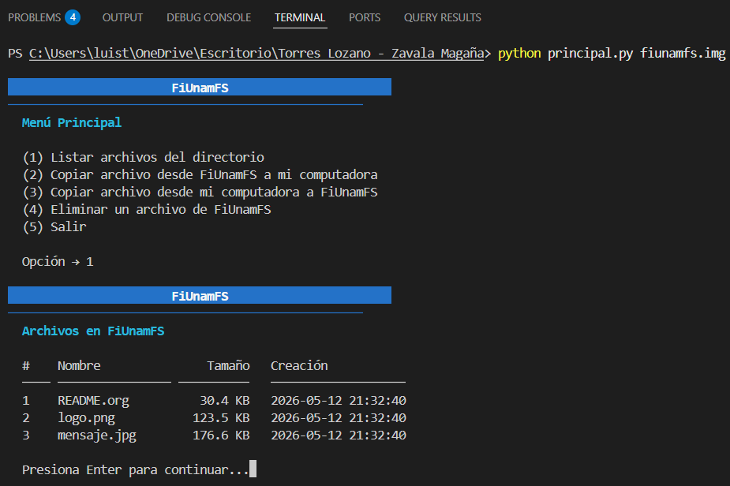
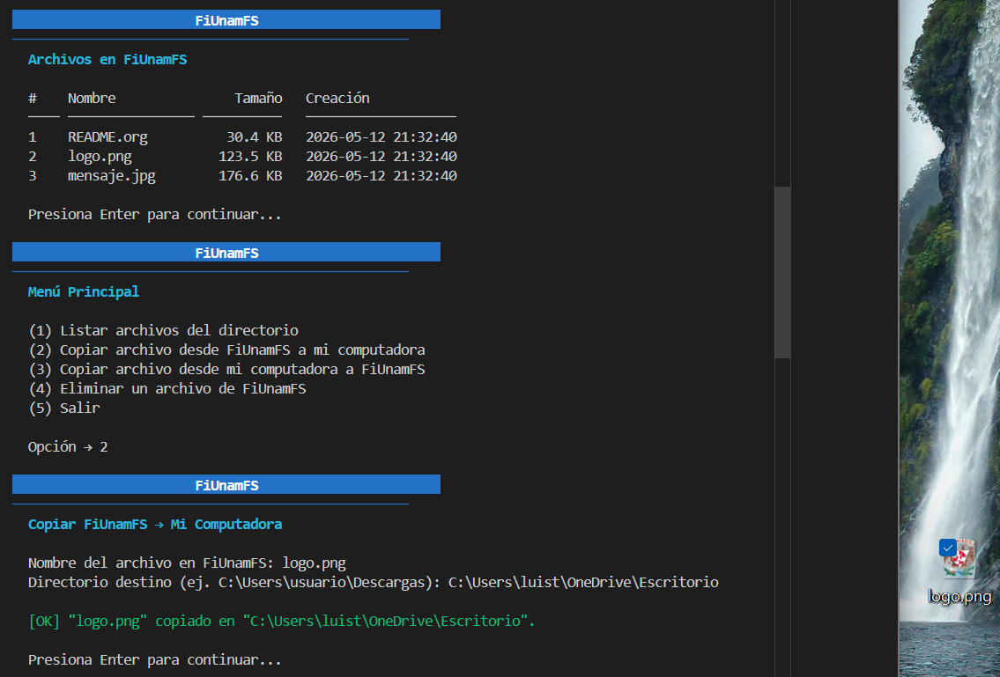
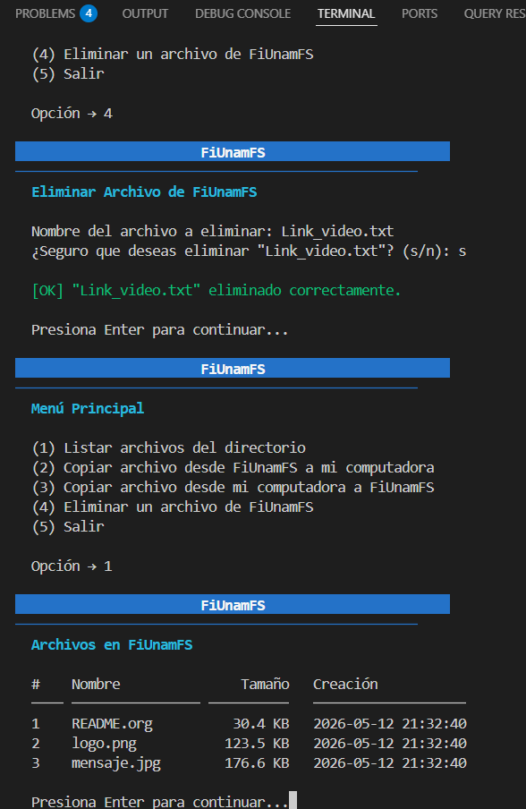
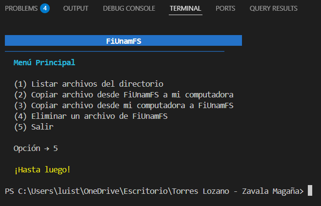

# FiUnamFS — Micro sistema de archivos multihilos

## Autores
- Luis Torres Lozano | No. Cuenta: 318209636
- Luis Arturo Zavala Magaña | No. Cuenta: 321045182

---

## Descripción

Programa en Python para leer y modificar imágenes del sistema de archivos **FiUnamFS**, desarrollado como proyecto final de Sistemas Operativos en la Facultad de Ingeniería, UNAM (semestre 2026-2).

FiUnamFS es un sistema de archivos plano de asignación contigua que simula un floppy de 1440 KB con un directorio único sin subdirectorios.

El programa fue desarrollado y probado con la imagen de ejemplo proporcionada por el profesor. Dicha imagen reporta la versión `24-2` en su superbloque, aunque la especificación del semestre indica la versión `26-2`. Por ello, el programa acepta ambas versiones para garantizar compatibilidad con cualquier imagen que se proporcione.

### Contenidos del disco de ejemplo

Al ejecutar el programa con el `fiunamfs.img` de ejemplo y listar el directorio, los archivos presentes son:

| # | Nombre | Descripción |
|---|--------|-------------|
| 1 | `README.org` | Archivo de texto con las instrucciones del proyecto |
| 2 | `logo.png` | Imagen del escudo de la Facultad de Ingeniería, UNAM |
| 3 | `mensaje.jpg` | Póster "Software Libre para una Sociedad Libre" |

---

## Operaciones soportadas

| Opción | Operación |
|--------|-----------|
| 1 | Listar archivos del directorio |
| 2 | Copiar archivo de FiUnamFS → computadora local |
| 3 | Copiar archivo de computadora local → FiUnamFS |
| 4 | Eliminar un archivo de FiUnamFS |
| 5 | Salir |

---

## Entorno y dependencias

| Componente | Detalle |
|---|---|
| Lenguaje | **Python 3.11 o superior** |
| Módulos externos | **Ninguno** — solo biblioteca estándar: `os`, `sys`, `struct`, `threading`, `datetime`, `math` |
| Sistema operativo | Linux, macOS o Windows 10+ |

> Si usas Python 3.9 o 3.10, cambia `int | None` por `Optional[int]`
> e importa `from typing import Optional`.

---

## Instalación y uso

### 1. Clonar el repositorio
```bash
git clone <url-del-repositorio>
cd fiunamfs
```

### 2. Colocar la imagen del sistema de archivos
Coloca el archivo `fiunamfs.img` en el directorio del proyecto.
Este archivo está en `.gitignore` porque se modifica durante el uso
del programa y no tiene sentido rastrear sus cambios con Git.

### 3. Ejecutar
```bash
python principal.py fiunamfs.img
```

---

## Estructura del proyecto

```
fiunamfs/
├── principal.py          # Interfaz de usuario y coordinación de hilos
├── sistema_archivos.py   # Lógica de lectura y escritura del sistema de archivos
├── entrada_directorio.py # Modelo de una entrada del directorio
├── utilidades.py         # Presentación: colores ANSI y limpieza de pantalla
├── README.md             # Este archivo
└── .gitignore            # Excluye fiunamfs.img y caché de Python
```

Cada módulo tiene una responsabilidad única y bien delimitada:

- **`entrada_directorio.py`** — Modela una entrada del directorio. Sabe leer su contenido desde el `.img` y copiarlo al sistema local.
- **`sistema_archivos.py`** — Toda la lógica de acceso a la imagen: leer el superbloque, parsear el directorio, buscar espacio libre, escribir entradas y datos.
- **`utilidades.py`** — Presentación: secuencias ANSI para colores y limpieza de pantalla, sin llamadas a comandos externos como `cls` o `clear`.
- **`principal.py`** — Orquesta los hilos, presenta el menú al usuario y maneja los semáforos de sincronización.

---

## Sincronización entre hilos

El programa lanza **5 hilos** coordinados exclusivamente con semáforos (`threading.Semaphore`):

| Semáforo | Valor inicial | Función |
|---|---|---|
| `sem_menu` | 1 | Controla cuándo puede mostrarse el menú |
| `sem_listar` | 0 | Señal para el hilo que lista archivos |
| `sem_local` | 0 | Señal para el hilo que copia hacia la PC |
| `sem_fs` | 0 | Señal para el hilo que copia hacia FiUnamFS |
| `sem_eliminar` | 0 | Señal para el hilo que elimina archivos |

El hilo `_menu` adquiere `sem_menu` y muestra las opciones. Al elegir una operación, libera el semáforo del hilo correspondiente. Ese hilo se despierta, ejecuta su tarea y devuelve el control liberando `sem_menu`. El ciclo se repite hasta que el usuario elige salir.

Adicionalmente, `sistema_archivos.py` usa un `threading.Lock` (`_candado`) para garantizar que las escrituras sobre la imagen sean atómicas y no ocurra corrupción si dos hilos intentaran escribir al mismo tiempo.

La función `listar_archivos()` lanza internamente **8 hilos** que leen el directorio en paralelo, usando una barrera manual (semáforo + contador protegido por un candado) para esperar a que todos terminen antes de devolver los resultados.

---

## Ejemplos de uso

### Menú principal


### Listar archivos del directorio (opción 1)
El programa muestra nombre, tamaño y fecha de creación de cada archivo.


### Copiar archivo de FiUnamFS a la computadora (opción 2)
Se indica el nombre del archivo y el directorio destino. El archivo aparece en el escritorio al terminar.



### Copiar archivo de la computadora a FiUnamFS (opción 3)
Se indica la ruta completa del archivo. Al listar después, el nuevo archivo aparece en el directorio.


### Eliminar un archivo (opción 4)
Se pide confirmación antes de eliminar. Al listar después, el archivo ya no aparece.



### Salir (opción 5)

