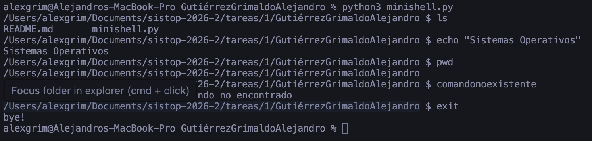

# Minishell — Tarea 1

**Autor:** Gutiérrez Grimaldo Alejandro  


---

## Descripción

Intérprete de comandos mínimo implementado en Python para sistemas Unix/Linux.  
El programa permite ejecutar programas del sistema manejando la creación de
procesos con `fork()`, la ejecución con `execvp()` y la recolección de procesos
hijos mediante la señal `SIGCHLD`.

---

## Requisitos

- Python 3.6 o superior
- Sistema operativo Unix/Linux (requiere `os.fork()`)

---

## Ejecución

```bash
python3 minishell.py
```

No requiere compilación ni dependencias externas.

---

## Uso

La shell muestra el directorio actual seguido de `$` como prompt:

```
/home/usuario $ ls -l
/home/usuario $ echo "Hola mundo"
/home/usuario/Documents $ exit
```

### Comandos internos

| Comando | Descripción |
|---------|-------------|
| `cd [dir]` | Cambia el directorio actual (sin argumento va al home) |
| `exit` | Termina el shell |
| `Ctrl+D` | Termina el shell (fin de archivo) |

---

## Diseño

### Flujo principal

1. Se configuran las señales al inicio (`SIGINT` ignorada, `SIGCHLD` con manejador propio).
2. El bucle principal lee una línea con `input()`, la parsea con `shlex.split()` y la ejecuta.
3. Para comandos externos se hace `fork()`: el hijo restaura `SIGINT` a su comportamiento
   por omisión y llama a `execvp()`; el padre espera con `waitpid()`.

### Manejo de señales

- **`SIGINT` (Ctrl+C):** El shell padre la ignora (`SIG_IGN`) para no interrumpirse.
  Cada proceso hijo restaura `SIGINT` a `SIG_DFL` antes de `exec`, por lo que
  Ctrl+C sí termina al hijo en ejecución.

- **`SIGCHLD`:** Se instala un manejador que llama a `os.waitpid(-1, os.WNOHANG)`
  en un bucle hasta que no queden hijos por recolectar. Esto evita procesos zombie.
  El padre también hace un `waitpid()` síncrono para esperar al hijo antes de
  mostrar el siguiente prompt.

---

## Ejemplo de ejecución



---

## Dificultades encontradas

- **Condición de carrera entre `SIGCHLD` y `waitpid()`:** El manejador de `SIGCHLD`
  puede recolectar al hijo antes de que el `waitpid()` del padre lo haga, lanzando
  una `ChildProcessError`. Se resolvió capturando esa excepción en el padre.

- **`SIGINT` en el hijo:** Si el padre ignora `SIGINT`, el hijo hereda esa configuración
  tras `fork()`. Es necesario restaurar `SIG_DFL` explícitamente en el hijo antes de
  llamar a `execvp()` para que Ctrl+C funcione normalmente en los programas ejecutados.

- **`cd` como comando interno:** Intentar implementar `cd` como un proceso hijo no
  tiene efecto en el shell; el directorio de trabajo solo puede cambiarse desde el
  proceso padre con `os.chdir()`.
